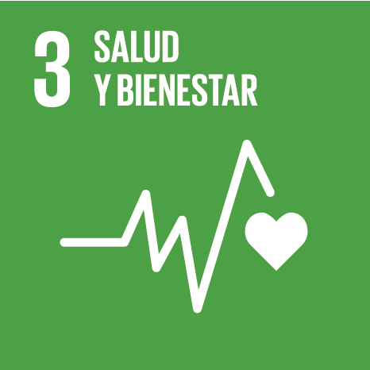
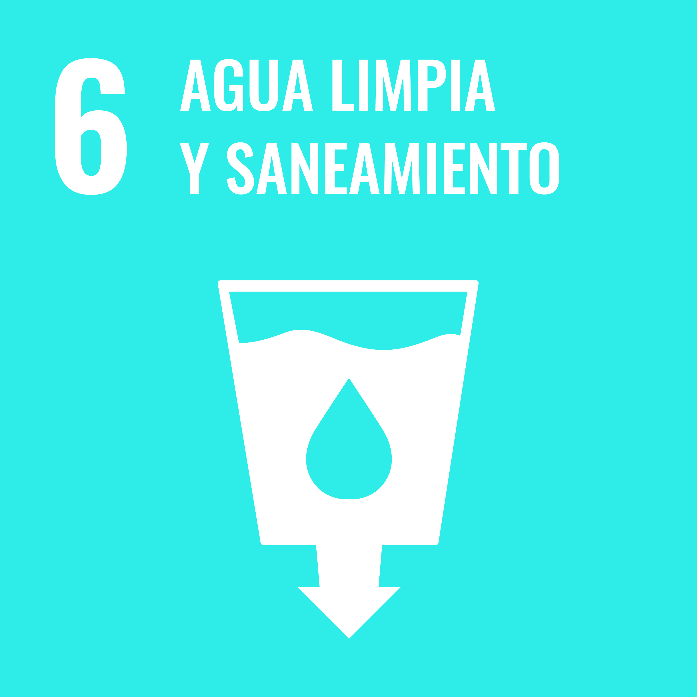
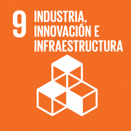
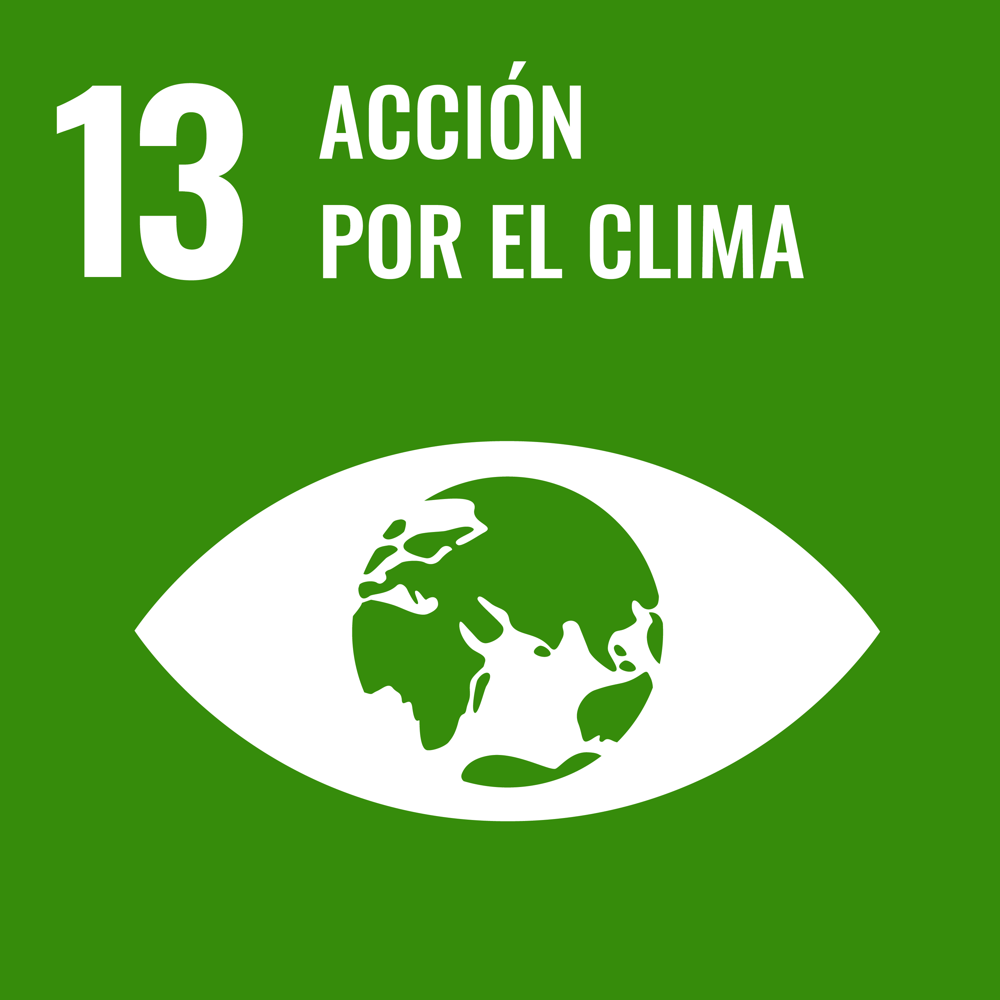
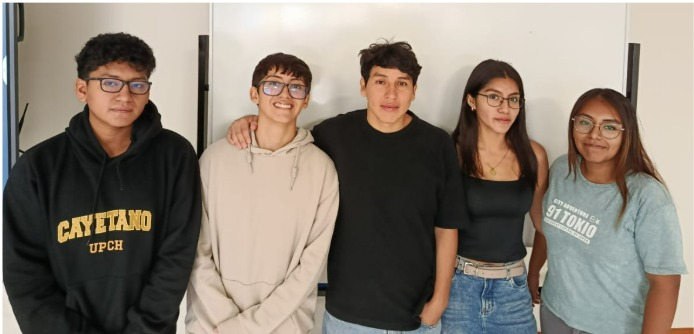
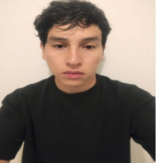
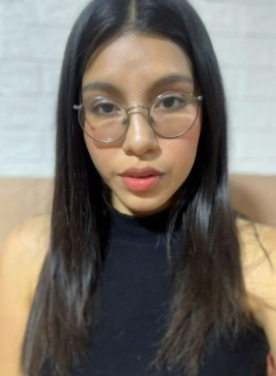
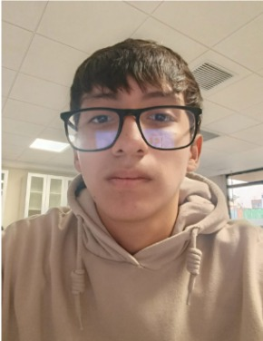
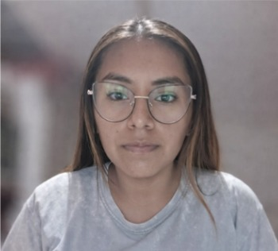
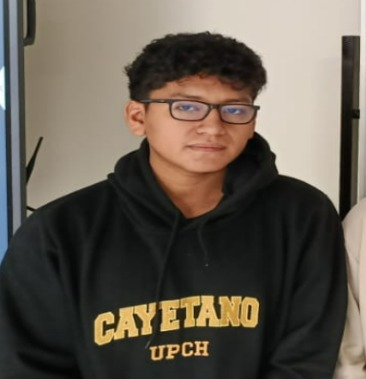

# Equipo 07 - Procesos de Innovación para la Ingeniería 
### Carrera de Ingeniería Industrial  
**Universidad Peruana Cayetano Heredia**

---

## 🌍 Descripción del Equipo 
Somos el **Equipo 07** del curso **Procesos de Innovación para la Ingeniería**, conformado por estudiantes de la carrera de Industrial.  
Nuestro objetivo es aplicar la metodología de diseño para generar soluciones innovadoras con impacto social, tecnológico y ambiental.  

Nos interesa trabajar en los siguientes **Objetivos de Desarrollo Sostenible (ODS):**  
proyecto-ods/
## 🌱 Objetivos de Desarrollo Sostenible (ODS)

Trabajaremos con los siguientes ODS:

### ODS 3 - Salud y Bienestar

### ODS 6 - Agua limpia y saneamiento

### ODS 9 - Industria, innovación e infraestructura

### ODS 11 - Ciudades y comunidades sostenibles

### ODS 13 - Acción por el clima

---

## 📸 Fotografía del Equipo  

  <em>Figura 1. Fotografía del equipo 07</em>

---

## 👥 Integrantes del Equipo  

| Foto | Nombre | Rol | Intereses |
|------|--------|-----|-----------|
|  | **Venegas Cartolini, Alimer** | Líder del equipo | Innovación social, sostenibilidad |
|  | **Tarazona Gonzales, Lucero Sofia** | Responsable de investigación |Generación de conocimiento útil, innovación con próposito, sostenibilidad integral|
|  | **Alarcón Camones, Renato Angelo** | Diseñador/a | Diseño de prototipos, creatividad aplicada |
|  | **Acrota Granados, Sharlene Angela** | Encargado/a de documentación | Comunicación científica, organización de la información,redacción técnica y síntesis de contenidos |
|  | **Valle Aguirre, Farid Alexandre** | Programador/a - Modelador/a | Programación, análisis de datos, simulación |

---

## 📌 Resumen Final  
Este README presenta quiénes somos como equipo, qué nos impulsa y  en qué ODS  queremos centrar nuestro trabajo a lo largo del curso en progreso para la ingeniería.

